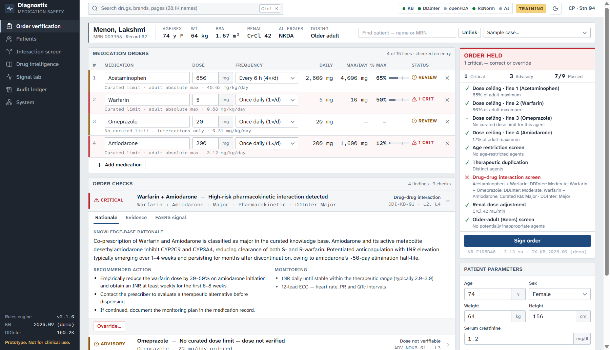
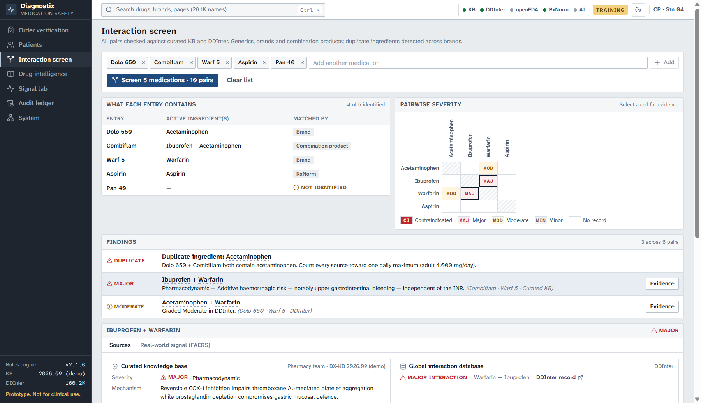
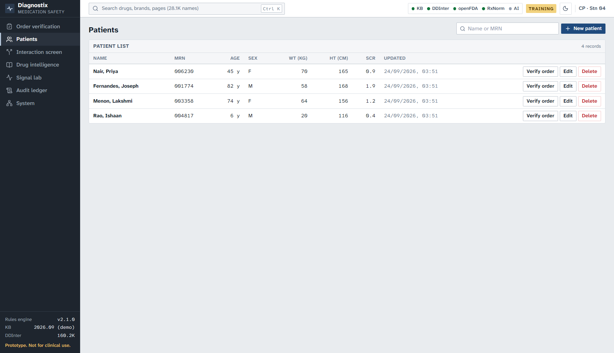
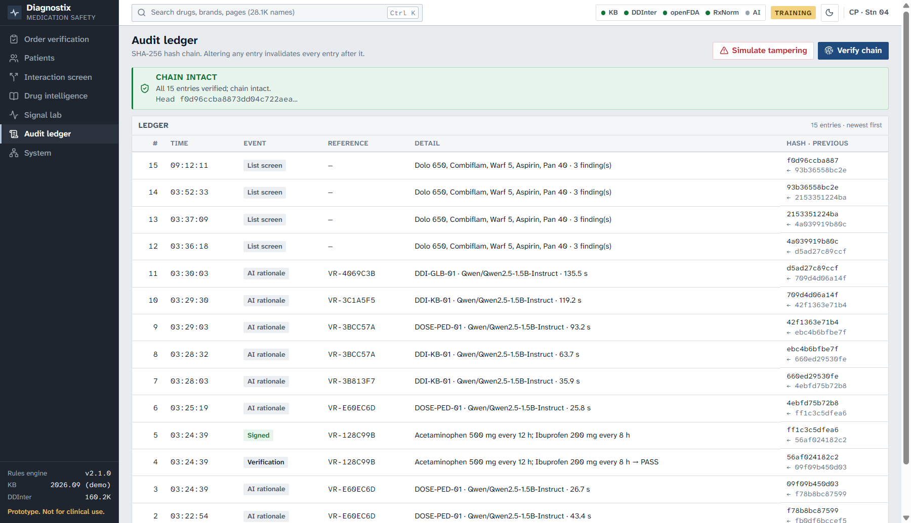

# Diagnostix CDSS

[](https://github.com/vishwajeetbedse/Diagnostrix/actions/workflows/ci.yml)
[](LICENSE)

Diagnostix checks medication orders for errors before they reach a patient. A pharmacist or doctor enters a patient and the drugs they want to prescribe. Diagnostix flags doses that are too high for that patient's age and weight, drugs that are dangerous together, and the same ingredient ordered twice under different brand names. Each warning explains why it fired and shows supporting evidence from FDA drug labels and real-world adverse-event reports. Every decision is written to a tamper-evident log.



## Disclaimer

**This is a prototype. It is not a certified medical device and must not be used for real patient care.** The dose limits in `backend/data/formulary.json` are demonstration values. A licensed pharmacist must validate them against institutional references before any real use. Interaction data comes from third-party sources that can be incomplete or wrong, and a missing warning does not mean a combination is safe. See also [DATA-LICENSE.md](DATA-LICENSE.md) for restrictions on the interaction data.

## Contents

- [Features](#features) · [Screenshots](#screenshots) · [Data sources](#data-sources) · [Architecture](#architecture)
- [Setup](#setup) · [Run](#run) · [Configuration](#configuration) · [Tests](#tests)
- [Demo script](#demo-script-about-5-minutes) · [How the signal is calculated](#how-the-signal-is-calculated)
- [Contributing](#contributing) · [License](#license)

## Features

| Screen | What it does |
|---|---|
| **Order verification** | Checks an order of up to 15 medications as you type. Accepts generic and brand names. For each line it shows the daily total, the patient's maximum and the percentage of that maximum. Interactions are checked between every pair of lines. **Sign order** is blocked while a critical finding is open. A finding can be fixed in one click (e.g. "Change to 250 mg every 4 h") or overridden with a written reason. |
| **Patients** | Saved patient records (name, MRN, age, sex, weight, height, serum creatinine) with search, edit and delete. Picking a patient on the verification screen fills in their details, and their record id is stored with every audit entry. |
| **Interaction screen** | Checks a full medication list, including Indian brands such as Dolo 650 and combination products such as Combiflam. Shows what each entry contains, a severity grid for every pair, and duplicate ingredients across brands. |
| **Drug intelligence** | For any drug: FDA label sections (boxed warning, interactions, dosing), most-reported adverse reactions, reports per year, reporting countries, and known interaction partners. |
| **Signal lab** | Tests whether a pair of drugs appears in more adverse-event reports than expected (see [How the signal is calculated](#how-the-signal-is-calculated)). |
| **Audit ledger** | Every verification, override, signature and AI output, stored in a SHA-256 hash chain. **Verify chain** detects any edit to a past entry, and **Simulate tampering** demonstrates this. |
| **System** | Architecture overview, live status of each data source, and cache contents. API documentation is served at `/docs`. |

## Screenshots

| | |
|---|---|
|  **Order verification** — four-drug order; interactions found on lines 2 + 4, 1 + 2 and 2 + 3 |  **Interaction screen** — duplicate paracetamol across two brands |
|  **Patients** — saved records |  **Audit ledger** — hash chain verified |

## Data sources

| Source | Used for | Decides alerts? | Access |
|---|---|---|---|
| Curated formulary | Dose ceilings, age limits and interaction write-ups for 10 drugs | **Yes** | Local JSON (`backend/data/formulary.json`) |
| [DDInter](https://ddinter.scbdd.com/) | Drug–drug interactions graded Major, Moderate or Minor (about 160,000 pairs across 1,900 drugs) | **Yes**: Major = critical, Moderate = advisory | Imported once into local SQLite; works offline |
| [openFDA drug labels](https://open.fda.gov/apis/drug/label/) | Quoted label text: boxed warnings, interaction sections, dosing | No, evidence only | Live, cached |
| [openFDA FAERS](https://open.fda.gov/apis/drug/event/) | Adverse-event reports (about 20 million, including reports from outside the US): reactions, outcomes, countries, pair signals | No, evidence only | Live, cached |
| [RxNorm (NLM)](https://lhncbc.nlm.nih.gov/RxNav/APIs/RxNormAPIs.html) | Maps brand names and misspellings to active ingredients; drug-name search | No | Live, cached |
| Local language model (Qwen2.5 via Hugging Face) | Rewrites the explanation paragraph in plainer language | **Never** | Local, optional |

**Licensing of this data.** DDInter is free for academic and non-commercial use only, and this project's Apache 2.0 license does not cover it. **Read [DATA-LICENSE.md](DATA-LICENSE.md) before any commercial or clinical use.**

- openFDA allows 1,000 requests a day without a key. A [free API key](https://open.fda.gov/apis/authentication/) raises this to 120,000.
- WHO VigiBase is the most complete global adverse-event database, but it has no public API, so it is not used.

## Architecture

```
React + TypeScript (Vite)  ──►  FastAPI /api/v1 (OpenAPI docs at /docs)
                                   │
        ┌──────────────────────────┼─────────────────────────────┐
        ▼                          ▼                             ▼
  DECISION LAYER             EVIDENCE LAYER               EXPLANATION LAYER
  deterministic, local       network, cached              local LLM, checked
  · rules engine (12 rules)  · openFDA labels             · Qwen2.5 (transformers)
  · curated formulary        · openFDA FAERS              · rejects any figure not in
  · DDInter (SQLite)         · RxNorm                       the verified facts
  · name resolver            · SQLite cache + circuit     · falls back to KB text
    (brand → ingredient)       breaker (serves cache
                               when a source fails)
        └──────────────────────────┬─────────────────────────────┘
                                   ▼
          Audit ledger (SHA-256 hash chain) · Patient records (SQLite)
```

**Design rules**

- **Only the decision layer can raise or clear an alert.** It is local and deterministic, runs in a few milliseconds and works offline.
- **Interactions are checked across every pair of order lines**, not just the first two. A drug repeated on several lines produces one duplication alert naming all of them.
- **Evidence shows where it came from:** the source name, whether it is live or cached, and how old it is.
- **The AI only rewrites the explanation paragraph.** If its text contains a number that is not in the verified facts, the text is discarded and the knowledge-base text is shown. The UI labels which of the two produced the text on screen, and "Show AI safety check" displays the facts the model was given, its output and the per-figure verdict. `POST /api/v1/ai/grounding-check` runs the same check on any text, which the System page uses for a live demonstration.
- **The app keeps working when a source fails.** After 3 consecutive failures it stops calling that source for 60 seconds and answers from the cache.

**Rules** (defined in `backend/app/core/engine.py`)

| Rule | Fires when | Severity |
|---|---|---|
| DATA-01 | Age, pediatric weight, dose or medication is missing | Critical, hard stop |
| DOSE-PED-01 | Under 18: daily dose above mg/kg/day × weight (capped at the adult maximum) | Critical |
| DOSE-ADT-01 | 18 or older: daily dose above the adult maximum | Critical |
| DDI-KB-01 | A pair is contraindicated in the curated formulary | Critical |
| DDI-GLB-01 | A pair is graded Major in DDInter | Critical |
| DDI-GLB-02 | A pair is graded Moderate in DDInter | Advisory |
| DUP-01 | The same ingredient is on more than one line | Critical, hard stop |
| AGE-01 | Patient is below the drug's minimum age | Critical, hard stop |
| ADV-CEIL-01 | Daily dose is at 90% or more of the maximum | Advisory |
| ADV-RENAL-01 | Kidney function is below the drug's adjustment threshold | Advisory |
| ADV-GER-01 | Older-adult (Beers criteria) caution | Advisory |
| ADV-NOKB-01 | Drug has no curated dose limit, so the dose was not checked | Advisory |

A hard stop cannot be overridden; the order must be corrected.

**Repository layout**

```
backend/
  app/
    core/        engine.py (rules) · rationale.py (explanations) · clinical_math.py · formulary.py
    sources/     openfda.py · rxnorm.py · ddinter.py · http.py (cache, retries, breaker) · cache.py
    services/    resolver.py · evidence.py · audit.py (hash chain) · patients.py · llm.py · prompts.py
    api/routes.py · container.py · main.py · config.py · fixtures.py (synthetic test data)
  data/formulary.json          curated knowledge base (edit this, not code)
  tools/                       import_ddinter.py · doctor.py · warm_cache.py
  tests/                       pytest suite, no network needed
frontend/
  src/pages/       VerifyPage · PatientsPage · ScreenPage · DrugPage · DrugIndexPage · SignalsPage · AuditPage · SystemPage
  src/components/  Shell (navigation, Ctrl+K search) · PatientForm · PatientPicker · DrugInput · Evidence · charts · LabelSections · ui
  src/styles/      tokens.css (light and dark themes) · base · shell · charts · pages
  dist/            prebuilt frontend, served by the backend
docs/              screenshots used in this README
```

The root-level `index.html`, `css/`, `js/`, `server/`, `tests/` and `package.json` are the original single-page prototype (v0.1). The current app does not use them.

## Setup

**Requirements**

- **Python 3.12.** `setup.sh` uses it (through the `py -3.12` launcher on Windows, `python3` elsewhere). `requirements.txt` targets Python 3.10–3.12.
- **Node.js 22 LTS** (or 20.19+) from <https://nodejs.org>. It is only needed to rebuild the frontend; a prebuilt copy is in `frontend/dist`.
- Several GB of free disk space if you enable the AI layer: PyTorch, plus the default model (about 3 GB), which downloads on first start.

In Git Bash on Windows, or a terminal on macOS/Linux:

```bash
git clone https://github.com/vishwajeetbedse/Diagnostrix.git
cd Diagnostrix
bash setup.sh
```

The script:

1. creates a `.venv` virtual environment;
2. installs the Python packages from `requirements.txt`;
3. builds the frontend, if `npm` is available;
4. downloads DDInter (about 25 MB) and imports it into `backend/data/ddinter.sqlite3`;
5. runs `python -m backend.tools.doctor`, which checks each live data source from your machine.

**Optional: cache everything the demo needs** (run on a good connection, for example before a presentation):

```bash
source .venv/Scripts/activate      # macOS/Linux: source .venv/bin/activate
python -m backend.tools.warm_cache
```

This caches labels, FAERS data and signals for every demo drug and pair, so the demo works without internet.

**If a step fails**

- **DDInter download blocked:** download the 8 CSV files from <https://ddinter.scbdd.com/download/> in a browser, then run `python -m backend.tools.import_ddinter --from-dir path/to/folder`.
- **Low memory or slow AI:** set `DX_MODEL=Qwen/Qwen2.5-0.5B-Instruct`, or turn the AI off with `DX_LLM=off`. Everything else still works. On a laptop CPU, one AI explanation took between about 25 seconds and 2 minutes in our testing.

## Run

```bash
bash start.sh              # Windows: double-click start-windows.bat
```

Open **<http://localhost:8000>**. API documentation is at <http://localhost:8000/docs>.

**Frontend development:** run the backend as above, then `cd frontend && npm run dev`. The dev server runs on <http://localhost:5173> and forwards `/api` calls to the backend on port 8000.

## Configuration

All settings are optional environment variables. Copy [`.env.example`](.env.example) to `.env` and edit it. The app reads `.env` from the project folder on startup, however it is started; variables already set in your shell take precedence. `.env` is git-ignored, so keys stay out of the repository. Never put a real key in `.env.example`, which is committed.

| Variable | Values | Effect |
|---|---|---|
| `DX_SOURCES` | `live` (default) · `offline` · `fixtures` | `offline` never uses the network. `fixtures` uses synthetic test data, and the UI shows a banner saying so. |
| `OPENFDA_API_KEY` | your key | Raises the openFDA daily limit |
| `DX_LLM` | `hf` (default) · `stub` · `off` | AI layer mode |
| `DX_MODEL` | Hugging Face model id | Default `Qwen/Qwen2.5-1.5B-Instruct` |
| `DX_DTYPE` | `auto` (default) · `float32` · `bfloat16` · `float16` | Model precision |
| `DX_DATA_DIR` | folder path | Where the SQLite databases live (default `backend/data`) |
| `PORT` | number | HTTP port (default `8000`) |

## Tests

```bash
python -m pytest backend/tests -q      # 42 tests
cd frontend && npm run typecheck
```

The tests cover the rules engine (including multi-drug orders), patient records, name resolution, DDInter lookup, ROR maths, caching, the circuit breaker, the audit chain and the API. They use synthetic fixtures, so they need no network access and no model download.

## Demo script (about 5 minutes)

Sample cases are loaded from the **Sample case** menu in the patient header on the Order verification screen.

1. **Pediatric paracetamol overdose** (loaded by default). A 6-year-old weighing 20 kg is ordered 500 mg every 4 h: 3,000 mg/day against a 1,500 mg/day limit (200%). Open the **Calculation** tab to show the arithmetic. Press **Sign order**; the order is held. Click **Change to 250 mg every 4 h** and the finding clears.
2. **Anticoagulant + antiarrhythmic.** On the warfarin + amiodarone finding, open **Evidence**: the curated write-up, the DDInter grade and quoted lines from both FDA labels. Open **FAERS signal** for the reporting odds ratios. Override with a reason, then sign.
3. **Polypharmacy, four agents.** Four drugs; the major interaction (warfarin + amiodarone) is on lines 2 and 4, and warfarin also has moderate interactions with the drugs on lines 1 and 3. Each finding names its two drugs. Use **Add medication** to add a fifth line.
4. **Patients.** Open **Patients**, click **Verify order** on a record, and the verification screen fills in that patient. Edit a value and use **Save to record**.
5. **Drugs outside the curated list.** Simvastatin + clarithromycin is caught through DDInter, with a note that simvastatin's dose could not be checked against curated limits.
6. **Interaction screen.** `Dolo 650, Combiflam, Warf 5, Aspirin, Pan 40` shows paracetamol duplicated across two brands and the warfarin bleeding interactions.
7. **Audit ledger.** Click **Verify chain**, then **Simulate tampering**, then **Verify chain** again; it names the entry that was edited.
8. **AI safety boundary.** On any finding's **Rationale** tab, the tag says whether the paragraph is *AI-generated* (with model and latency) or *Knowledge-base text* (with the reason). Open **Show AI safety check** to see the facts, the output and every figure checked. Click **Simulate hallucinated figure**: the largest figure is changed, the real server-side check rejects it, and the knowledge-base text returns. **Undo simulation** restores the previous state. This works even with the AI off. For a standalone version, open **System → Grounding check — try it**, choose *Invented dose* (fails) or *Faithful rewording* (passes), or click **Inject a fabricated figure**.

## How the signal is calculated

For each reaction R, the Signal lab builds a 2×2 table from FAERS report counts:

| | Reaction R | Other reactions |
|---|---|---|
| Reports mentioning the drug(s) | a | b |
| All other reports | c | d |

- **Reporting odds ratio:** ROR = (a/b) ÷ (c/d).
- **95% confidence interval:** exp(ln ROR ± 1.96·√(1/a + 1/b + 1/c + 1/d)).
- A **signal** is flagged when there are at least 3 reports and the lower bound of the interval is above 1.
- The chart compares the pair with each drug alone, which shows whether the combination adds risk beyond either drug.

FAERS is a voluntary reporting system. Counts reflect what was reported, not how often reactions actually happen. A signal is a question for review, not proof that a drug caused a reaction.

## Contributing

This was built for a hackathon. Issues and pull requests are welcome. See [CONTRIBUTING.md](CONTRIBUTING.md) for how to run the tests and dev servers and how to report a bug. Changes are listed in [CHANGELOG.md](CHANGELOG.md).

## License

The source code is licensed under the [Apache License 2.0](LICENSE). Copyright 2026 Vishwajeet Bedse.

Third-party data, in particular DDInter, is **not** covered by that license. See [DATA-LICENSE.md](DATA-LICENSE.md).
